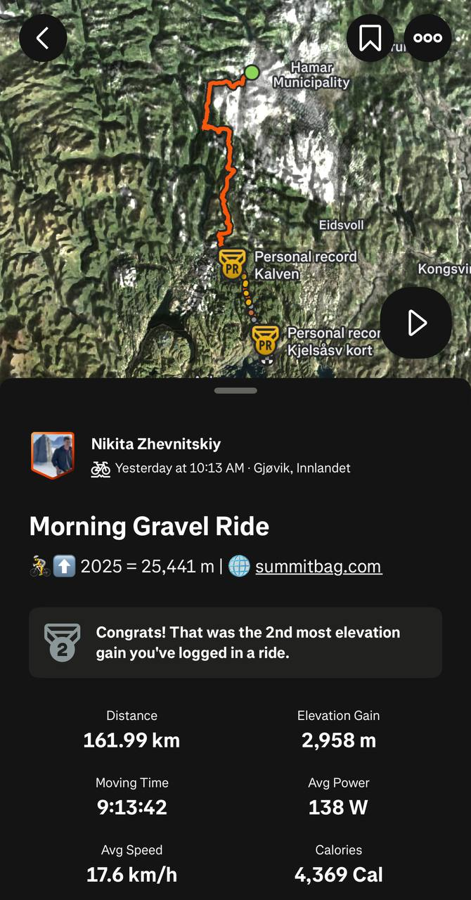

# Gjøvik-Oslo gravel (150km+; 2500m+ elevation)

**[Download route GPX file](Gjøvik-Oslo.gpx)**

| Distance  | Elevation Gain | Description  |
|-----------|----------------|--------------|
| 150-160km | 2500-3000m     | One day trip |

## Additional

You can take train from Oslo Jernbanetorget to Gjøvik, do not forget buy bicycle place.

## Media

