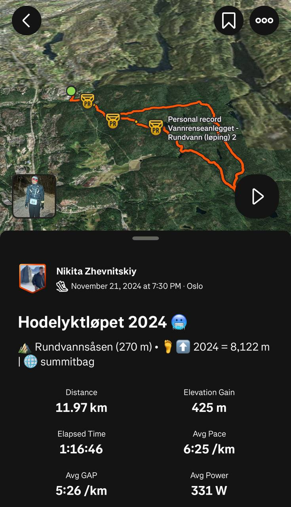

# Hodelyktløpet (12km, 425m elev.)

**[Download route GPX file](Hodelyktløpet.gpx)**

| Distance | Elevation Gain | Description          |
|----------|----------------|----------------------|
| 12km     | 425m           | Two-three hours trip |

## Additional

You can take bus from Oslo Jernbanetorget to Skullerud.
The route through Østmarka forest, works best for trail running and hiking.

This is the official route for race [Hodelyktlopet](https://www.ostmarkatrail.no/hodelyktlopet/)

## Media

